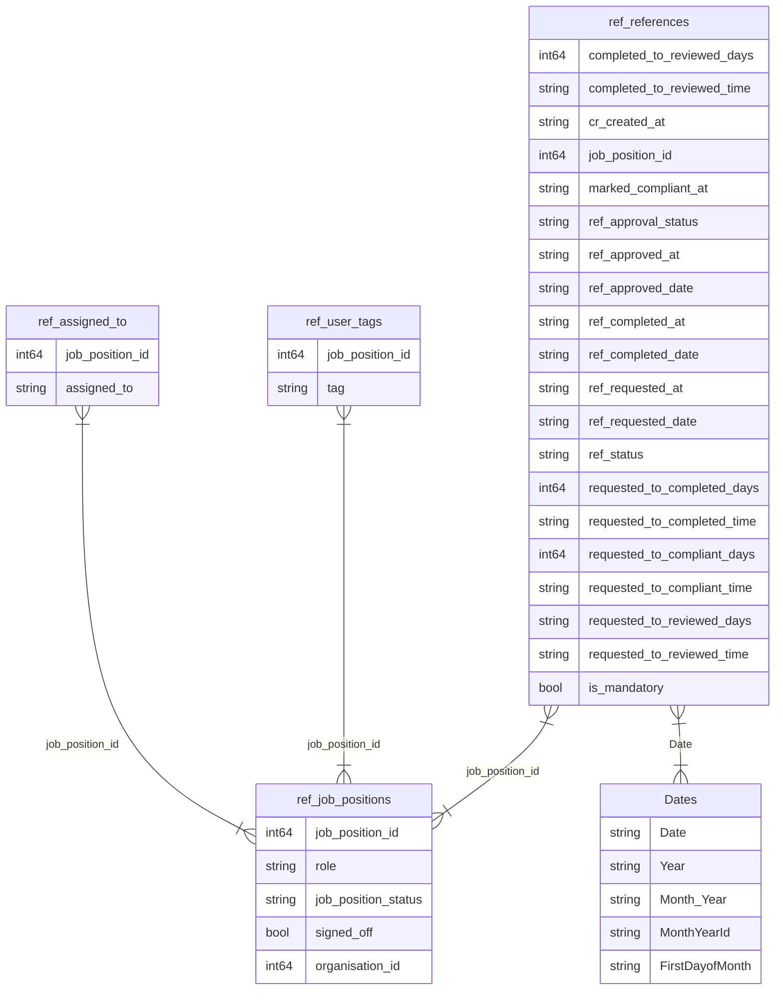

# Assignment notes

## Solution

The files for a solution are held in the `solution` folder.

## Environment

`$ pyenv install 3.11.11`

`$ pyenv local 3.11.11`

`$ python -m venv .venv`

`$ source .venv\bin\activate`

## Diagram
Using: https://mermaid.js.org/

Relationships are in: References.SemanticModel/definition/relationships.tmdl

