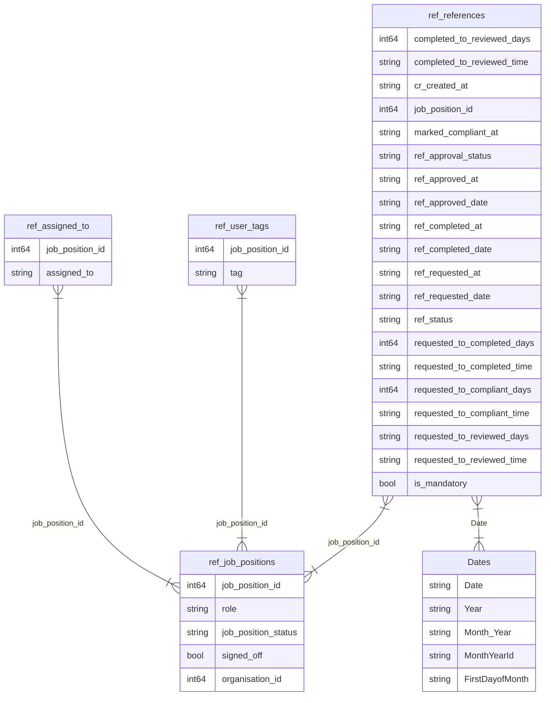

# Assignment notes

## Solution

The files for a solution are held in the `solution` folder.


## Environment

`$ pyenv install 3.11.11`

`$ pyenv local 3.11.11`

`$ python -m venv .venv`

`$ source .venv\bin\activate`

## Diagram
Using: https://mermaid.js.org/

Relationships are in: References.SemanticModel/definition/relationships.tmdl

There is a reference to `organisation_id` in ref_job_positions but there is no organisation
table provided.



## Modelling the Data

The modelled data is in References.Report/definition/pages/6e535bbac021e5cbee7b/page.json
under the `filters` 

When converted to SQL it looks something like this:

```sql
SELECT 
    r.*, 
    jp.role,
    jp.job_position_status,
    jp.signed_off,
    ut.tag,
    at.assigned_to
FROM 
    ref_references r
LEFT JOIN ref_job_positions jp 
    ON r.job_position_id = jp.job_position_id

-- Filtering logic references ref_user_tags and ref_assigned_to
LEFT JOIN ref_user_tags ut 
    ON ut.job_position_id = jp.job_position_id

LEFT JOIN ref_assigned_to at 
    ON at.job_position_id = jp.job_position_id

-- Optional join to Dates table, if needed for time-based filtering
-- LEFT JOIN Dates d ON r.ref_requested_date = d.Date

WHERE
    -- Exclude null job positions
    r.job_position_id IS NOT NULL

    -- Inverted filters (Not IN)
    AND jp.role NOT IN (<selected_roles>)                -- e.g., ('Manager', 'Admin')
    AND ut.tag NOT IN (<selected_tags>)                  -- e.g., ('External')
    AND at.assigned_to NOT IN (<selected_assignees>)     -- e.g., ('John Smith')

    -- Inclusive filters (IN)
    AND jp.job_position_status IN (<statuses>)           -- e.g., ('Active', 'On Leave')
    AND jp.signed_off IN (<true_or_false>)               -- e.g., (true, false)
    AND r.is_mandatory IN (<true_or_false>)              -- e.g., (true, false)
    AND r.ref_form_name IN (<form_names>)                -- e.g., ('Form A', 'Form B')
    AND r.ref_package_name IN (<package_names>)          -- e.g., ('Standard', 'Advanced')
;

```

## Reference Statuses

The workflows are quite straightforward

Using the `ref_approval_status` column

- Requested
- Submitted (for Approval)
- Approved
- Declined

There is greater detail in the `ref_status` column

- SENT
- OPENED
- EMAIL_BOUNCED
- EXPIRED
- AWAITING_APPROVAL
- APPROVED
- DENIED

## Solution

There are many options for presenting dashboards Metabase (a personal favourite), Streamlit, Dash, Tableau, Looker, and many more.

For this solution I'm going to use **Dash** from Plotly.

It satisfies the dashboard requirement quite simply by allowing the developer to link
data sources to the dashboard which is displayed in an HTML page on the user's machine (in this case).

**DuckDB** is now an increasingly common choice for manipulating data. It uses the Postgres SQL engine to query data and 
is a very flexible solution when handling diverse data sources.

```commandline
$ pip install pandas
$ pip install duckdb
$ pip install dash
```

## Reports/Metrics

There are many key metrics and KPIs that could be extracted from the data.

Some thoughts about which could be useful in a professional environment:

- Number of References handled (Requested) per day/week. Can be further refined with seasonality and holidays (eg. Spring, summer, Christmas, Easter etc)
- Highest/Lowest performing Assignee (possibly look at internal vs external if it applies)
- Most/Least References by Organisation
- Averages of processing times to highlight high/low data points
- Assignees rejecting high numbers of References (Indicates need for some further analysis)
- Organisations where high numbers of References are rejected (Indicates possible issues with their selection critieria)
- Rolling averages of references submitted to review.
- Bollinger Bands (can be creatively used to highlight anomalies in high volumes of data)
- Form analysis. See which forms are in use/still in use
- Package analysis. Which are the most used/successful
- Basics:
  - Requested -> Submitted Days
  - Submitted -> Reviewed Days
  - Requested -> Reviewed Days
- Activity by Day of Week

## Running the dashboard

Assuming the virtual environment is correctly set up.

` % python ./solution/dashboard.py`

This will start a webserver at  http://127.0.0.1:8050/ (port may be different if already in use on your machine)

Navigate to the Dash page and take a look at the (simple) graphs. 
More sophisticated formatting is available, it is basically HTML, and more graph
functions can be turned on/off.


